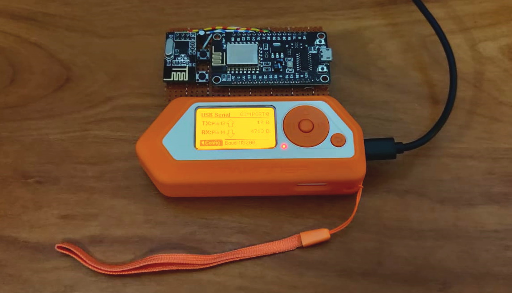

# Flipper Zero Scripts & Tools

This is my personal collection of scripts, dumps and tools for the Flipper Zero.

## Hardware

#### [WiFi Board (ESP8266 NodeMCU + NRF24L01)](hardware/wifi_board)

## Bad-USB

#### Categories

|Category|Description|
|-|-|
|`Fun`|Fun party tricks.|
|`Passwords`|Ways to extract passwords.|

#### Scripts

|File|Description|
|-|-|
|`Fun/Parrot_X.txt`|Party parrot for OSX / Windows.|
|`Fun/RickRoll_Term_X.txt`|Rick Roll for OSX / Windows terminal.|
|`Fun/RickRoll_YT_X.txt`|Rick Roll for OSX / Windows using YouTube.|
|`Passwords/Saved_Passwords_Win.txt`|Extracts passwords from Windows.|
|`Passwords/WiFi_Passwords_Win.txt`|Extracts WiFi passwords from Windows.|

## IR Dumps

#### Audio

|File|Brand|Description|Complete|
|-|-|-|-|
|`Audio/Winnes_KC_809`|Winnes|CD Player|**Yes**|
|`Audio/Yamaha_RX_a860`|Yamaha|Audio Amplifier|No|

#### Smart

|File|Brand|Description|Complete|
|-|-|-|-|
|`Smart/LEDStrip`|Unknown|Generic LED Strip Remote|**Yes**|

#### TV

|File|Brand|Description|Complete|
|-|-|-|-|
|`TV/Panasonic_N2QAYB000752`|Panasonic|TV|**Yes**|
|`TV/Sony_KDL_55HX850`|Sony|TV|**Yes**|

## Sub-Ghz

|Device|Category|Description|
|-|-|-|
|`Flamingo/SF_501`|Smart|Dumps for Flamingo SF-501 Remote/Socket pairs.|
|`Byron/DB421E`|Doorbell|Dumps for Byron DB421E doorbell set.|
