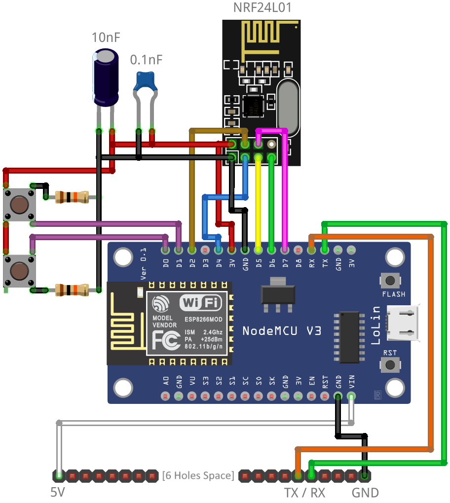
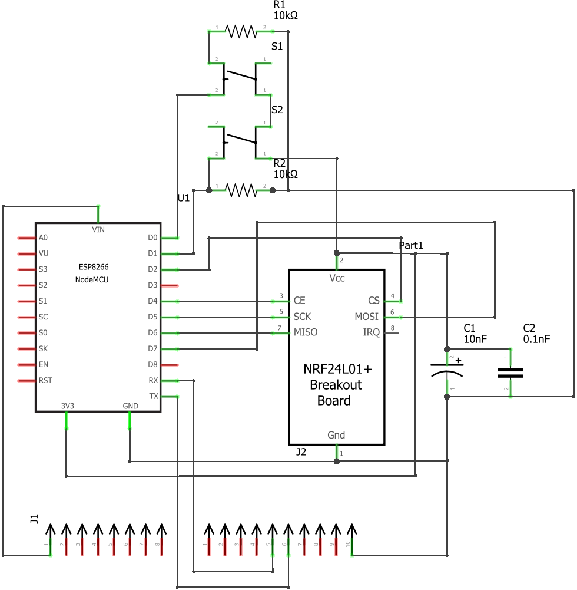
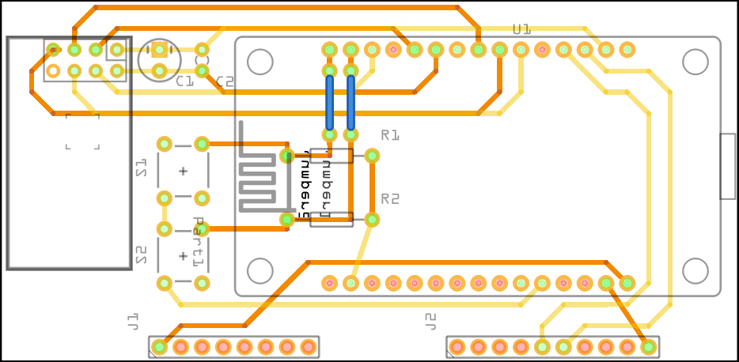
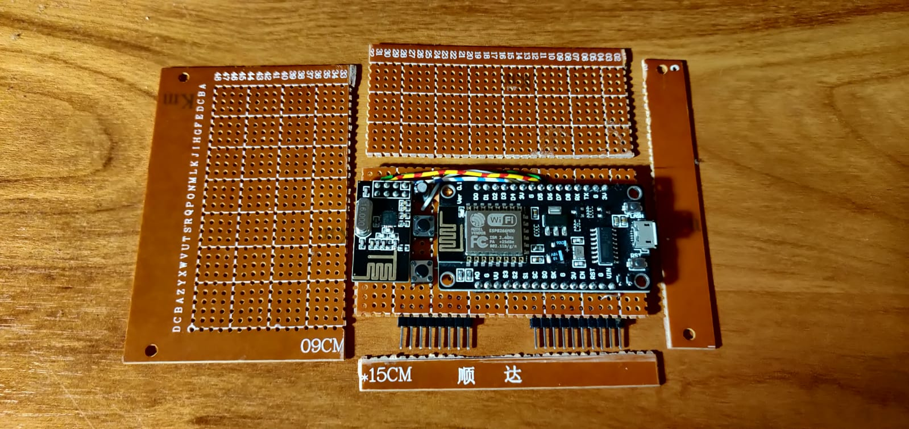
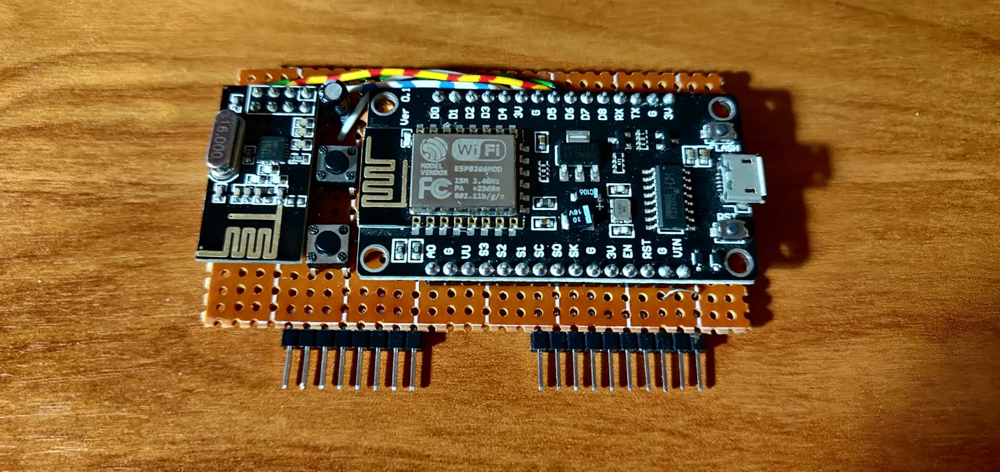
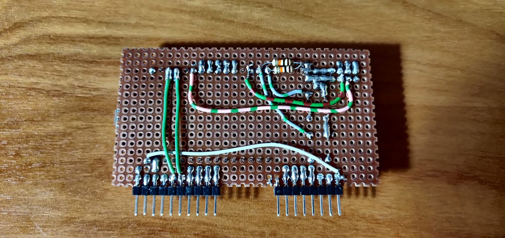

	

# WiFi Board

**Note:** `This board can *NOT* be compared to the original Flipper Zero WiFi Devboard which runs on a different processor and has other features which are *NOT* compatible with this board.`

This small DIY module for the Flipper Zero allows you to perform WiFi operations (Attacks, Access Points, Webserver, etc.) and transmit data over 2.4 Ghz using the NRF24L01.

A <a href="https://fritzing.org/" target="_blank">Fritzing</a> project file has been included which can be used as reference or to create a custom PCB.

**In general:** \
The board communicates to the NodeMCU over a serial connection. This means to control it from the Flipper directly, you have to create custom firmware that sends and receives / interprets the serial communication.

For now, I am using the builtin **UART Bridge** functionality from the Flipper:

- `Menu > GPIO`
- Set `5V on GPIO` to `on`
- `USB-UART Bridge`
- Press `<` to enter the config
- Set the `Baudrate` to either `Host` or in this case `115200`
- Press `Back` and connect the Flipper via USB to a device that can run a Serial Terminal like the **Arduino IDE Serial Monitor** or **Putty**.

### Note:

Flashing the NodeMCU can be done using the NodeMCU's own USB port like you would normally. **MAKE SURE** however to disconnect the board from the Flipper **BEFORE** you connect the NodeMCU's USB to an external device.

Failing to follow this procedure will result in the NodeMCU failing to flash / run and may even **DAMAGE** your Flipper due to the USB voltage being directly connected to the 5V line of the Flipper. (This varies between NodeMCU versions)

## Materials

*Required:*
- **Dotted Perfboard**
- **8x1 Male Dupont Header**
- **10x1 Male Dupont Header**
- **ESP8266 (NodeMCU) WiFi Development Board**
- **NRF24L01 2.4Ghz Transceiver**

*Recommended:*
- **10nF Electrolytic Capacitor** (To increase NRF24L01 stability)
- **0.1nF Ceramic Capacitor** (To increase NRF24L01 stability)

*Optional:*
- **2 Tactile pushbuttons** (For quick actions / macros)
- **(2x) 10K Ohm resistor** (Required if you want too add the buttons)

## The Code

For software I am currently using <a href="https://github.com/SpacehuhnTech/esp8266_deauther/tree/v3" target="_blank">ESP8266 Deauther 3.0</a> By **Spacehuhn**.

In the future I am planning to adapt from Deauther 3.0 and add a purpose to both the NRF24l01 and the pushbuttons.

## The Build & Schematic

The build was done on a piece of prototyping perfboard and most of the connections are done by soldering wires instead of proper traces. I attempted to create a quick dual layer PCB layout which I think will work but has **NOT** been tested!

#### Visual Schematic

#### Schematic

#### Dual Layer PCB Layout (UNTESTED!)

## Pictures

