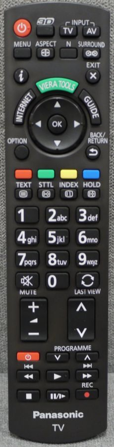

# Panasonic N2QAYB000752

Infra red signal files for the Flipper Zero.

**Compatible with:**

 - PANASONIC TX-23LX50F
 - PANASONIC TX-L32ET5E
 - PANASONIC TX-L37ET5E
 - PANASONIC TX-L42ET5E
 - PANASONIC TX-L47ET5E
 - PANASONIC TX-L55ET5E
 - PANASONIC TX-L55ETW5
 - PANASONIC TX-P42UT50
 - PANASONIC TX-P50XT50E
 - PANASONIC TX-PF46ST30

